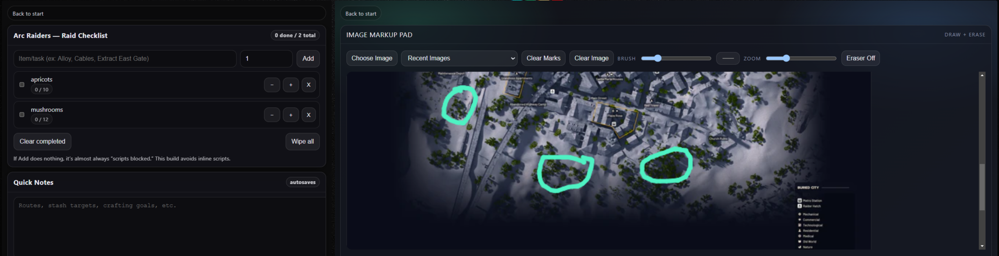

#CheckPoint Zero



This is a small utility app I made that lets you create checklists for items you’re gathering or enemies you need to track. It also displays maps or reference images that you can mark up with notes, making it easy to plan and keep everything in one place.mushroomsmush  

## iCue iFrame

Use this in iCue to embed the page:

```html
<iframe
  src="http://localhost:8080/start.html"
  width="420"
  height="520"
  frameborder="0"
></iframe>
```

## Tray app (Windows)
Run the CorsairTray.exe and it will minimize to the system tray.
It will then run a small server to http://localhost:8080/start.html
Once you embed that code into a iFrame in the Xeneon Edge widget you will be able to use this. I recommend do one coumn of two for the checklist and then the XL to a map. You can use any image you want and mark it up.

Notes:

- Right-click the tray icon and choose Quit to stop the server.
